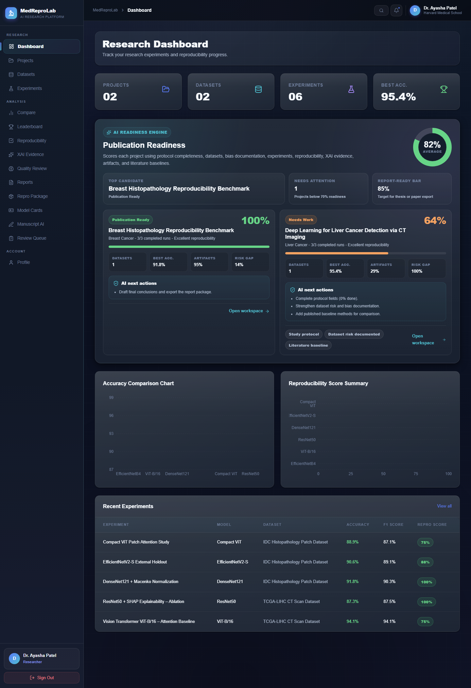
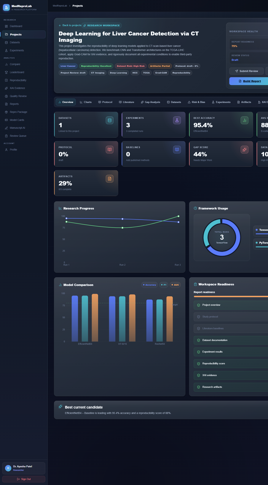
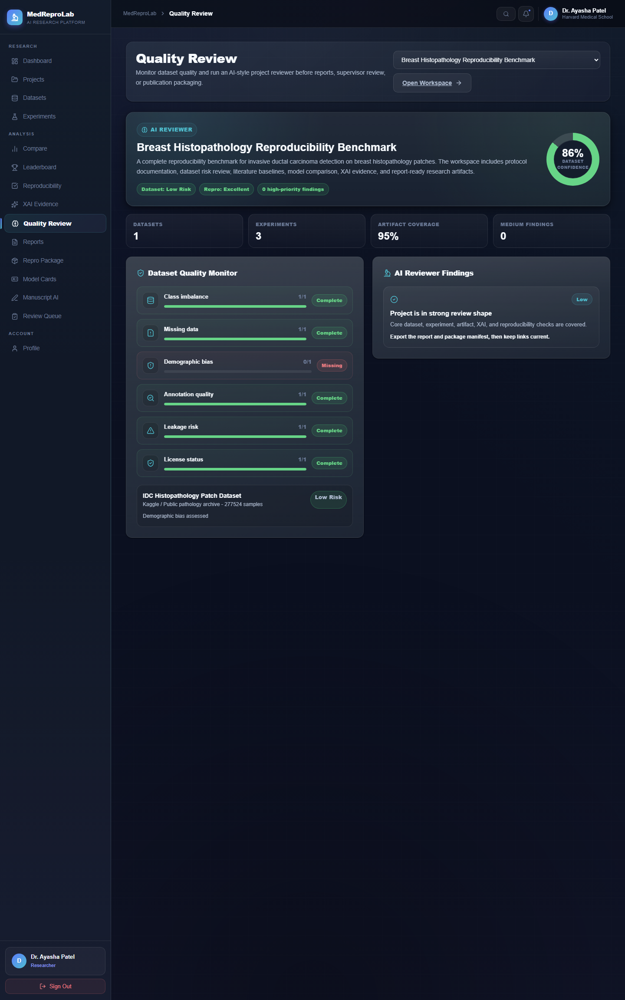
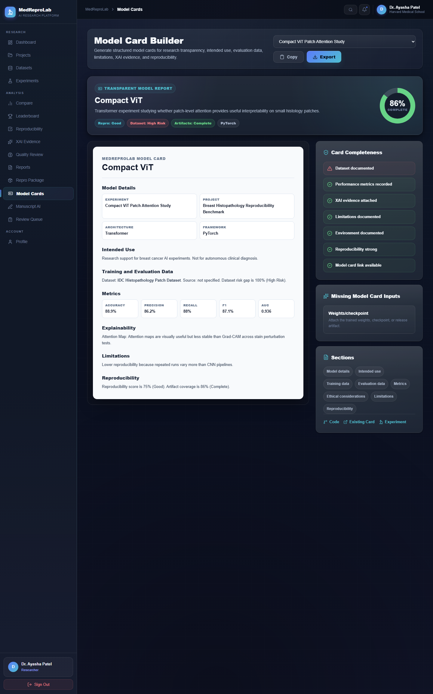
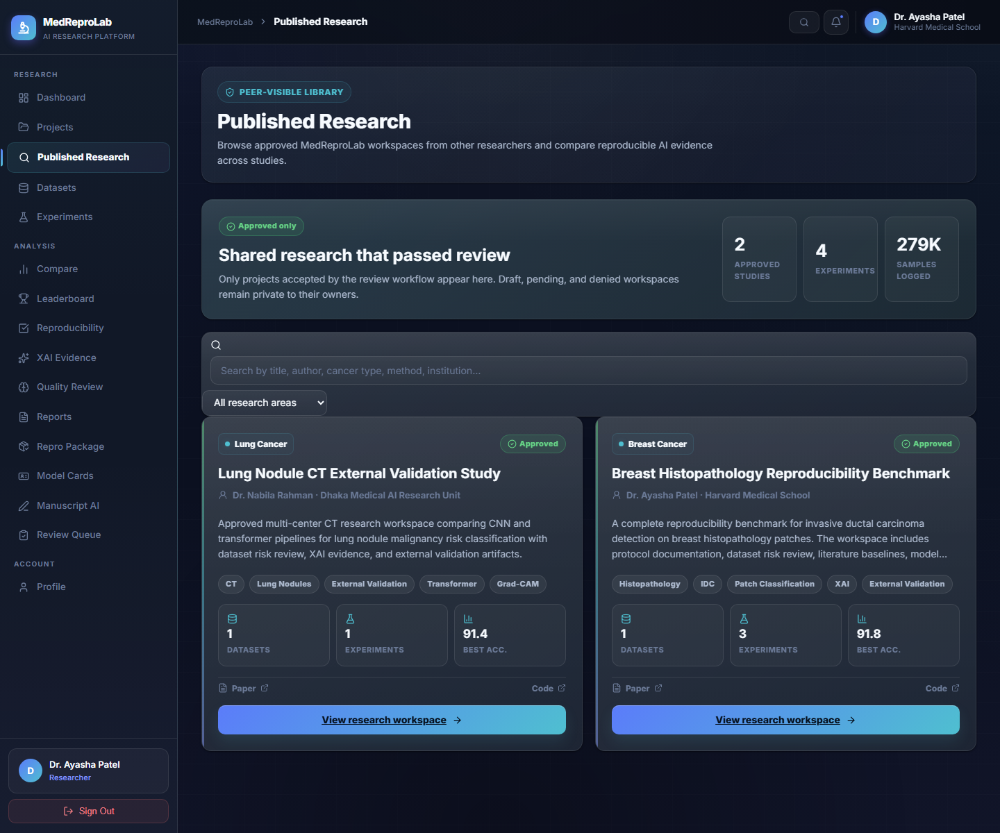

# MedReproLab

MedReproLab is a MERN-stack medical AI research reproducibility platform for managing cancer research projects, datasets, experiments, model comparisons, quality review, admin approvals, and approved published research visibility.

It is designed for academic research workflows, not clinical diagnosis. Researchers can document datasets, run and compare experiments, review reproducibility evidence, generate model cards, prepare reports, and publish approved research workspaces for other users to explore.

## Features

- Research project workspaces for cancer AI studies
- Dataset quality and bias risk monitoring
- Experiment tracking with accuracy, F1, AUC, and reproducibility evidence
- Model comparison, leaderboard, and modern charts
- AI reviewer suggestions for missing validation, artifacts, and documentation gaps
- Admin review queue for approving or denying submitted research
- Published Research page for approved projects from other researchers
- Report builder, model card builder, and reproducibility package support
- MongoDB-backed dynamic data with JWT authentication

## Screenshots

### Dashboard



### Project Workspace



### Quality Review



### Model Card Builder



### Published Research



## Tech Stack

- React
- Node.js
- Express.js
- MongoDB and Mongoose
- JWT authentication
- REST API
- CSS
- Lucide React icons

## Database

The backend uses MongoDB through Mongoose.

Default local database:

```env
MONGO_URI=mongodb://localhost:27017/medreprolab
```

You can also use MongoDB Atlas by replacing `MONGO_URI` in `server/server/.env`.

## Backend Setup

```bash
cd server/server
copy .env.example .env
npm install
npm run dev
```

Backend:

```text
http://127.0.0.1:4000
```

Admin panel:

```text
http://127.0.0.1:4100
```

MongoDB health:

```text
http://127.0.0.1:4000/api/health
http://127.0.0.1:4000/api/db/status
```

## Frontend Setup

```bash
npm install
npm run dev -- --host 127.0.0.1 --port 5173
```

Frontend:

```text
http://127.0.0.1:5173
```

## Demo Data

Seed the main sample project:

```bash
cd server/server
node seedSample.js
```

Seed the additional breast histopathology sample project:

```bash
cd server/server
node seedBreastSample.js
```

Seed the approved public research sample:

```bash
cd server/server
node seedPublishedResearch.js
```

Demo login:

```text
demo@medreprolab.ai
Demo@1234
```

Admin login:

```text
admin@medreprolab.ai
Admin@1234
```
